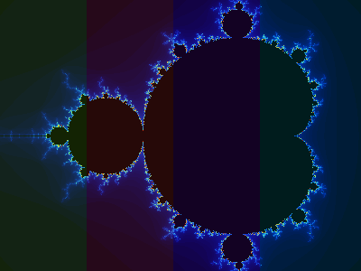

# FractalHive

**An interactive Mandelbrot renderer where image tiles bid for compute: a working
miniature of a real time compute auction.** Written in OCaml (stdlib only), with a browser
canvas frontend talking to a tile server over raw sockets.


## The idea

Rendering a fractal is embarrassingly parallel, but the tiles are *not* equal: a tile on the
set's boundary is expensive and full of detail, while a tile in empty space is cheap and
uniform. So you have a pile of compute jobs of wildly different value and cost, exactly the
situation a market solves.

FractalHive treats each tile as a **bidder**. A tile bids the variance of the escape counts at
its corners and center: high variance means it straddles the boundary (lots of detail), so it
bids high and renders first. Workers are the scarce resource; the highest bidders win them.

Zoom in and you *watch* the boundary sharpen before the flat regions fill: the auction, made
visible.

## The result: partitioning vs arbitrage

Shard the image into *k* **markets**, each with its own queue and a share of the workers. How
you shard matters enormously, and that is the interesting part.

With **contiguous bands**, the centered set concentrates the boundary into a couple of markets,
so left alone (**siloed**) the outer markets' workers drain and idle while the boundary markets
starve. Turn on **arbitrage** (an idle worker steals the highest bidding tile from any market)
and the wasted compute comes back. But a fair partition changes the picture. Measured (4 markets,
8 workers, default view, medians of 3 warm runs):

| Partition | Siloed | Arbitrage | Arbitrage win |
|-----------|-------:|----------:|--------------:|
| Band (contiguous) | 1640 ms · 35% util | 750 ms · 91% util | **2.2×** |
| Strided (interleaved) | 790 ms · 84% util | 755 ms · 90% util | **1.05×** |

Three things fall out of this:

1. **Fair partitioning alone recovers most of the waste.** Interleaving columns lifts siloed
   utilization from 35% to 84% and halves wall time, with no coordination at all.
2. **On a fair partition, arbitrage adds almost nothing** (~5%). Its headline 2.2× on bands was
   mostly compensating for a bad partition.
3. **Arbitrage makes wall time nearly independent of the partition.** Band arbitrage (750 ms) and
   strided arbitrage (755 ms) land in the same place. It is the robustness layer: it matters
   exactly when demand is lumpy and you *can't* partition evenly ahead of time, which is the
   realistic case for a trading desk, and why a global auction beats siloed clusters.

The `benchmark` button draws both partitions as per worker utilization bars; the tinted bands
below show a 4 market split.



(Numbers are medians of 3 warm single runs; absolute ms drift run to run, the ratios are stable.)

## Run it

Needs OCaml (5.x) + dune via opam. On a normal machine:

```bash
dune exec bin/main.exe -- --port 8080 --workers 8
```

This project was built on a Windows machine with **Smart App Control enforced**, which blocks
`ocamldep` and the native toolchain, so `dune build` can't run there. The workaround is a
plain bytecode build that runs via `ocamlrun` (SAC allows bytecode; it's data, not a PE):

```bash
bash build.sh                 # compiles to fractalhive.byte with ocamlc, no ocamldep
bash run.sh --port 8080 --workers 8
```

Then open **http://localhost:8080**. Drag to pan, scroll or `−`/`+` to zoom, move the workers
slider, pick a market count and partition, toggle arbitrage, and hit **benchmark**.

## Engineering note: routing around Smart App Control

`dune build` would not run on the build machine; it died with `CreateProcess(): An Application
Control policy has blocked this file`. The block was one specific binary, `ocamldep` (the
compilers themselves ran fine), which dune needs for dependency analysis. Smart App Control was
enforced, and it can't be exempted per file or safely turned off (disabling it is a one way trip
that needs a Windows reinstall). So the build routes around it: `build.sh` compiles the modules
by hand in dependency order with `ocamlc` into plain bytecode, and `run.sh` runs that via
`ocamlrun`. Bytecode is data executed by an already trusted runtime, not a fresh unsigned
executable, so SAC lets it through, and the `dune` files still work on an unrestricted machine.
Full trace in `journal.md`.

## Architecture

```
browser <canvas>  ──HTTP──▶  OCaml tile server ("the hive")
  pan/zoom/controls            /render  stream framed tiles, rendered in parallel
  paints tiles as they         /stats   benchmark siloed vs arbitrage -> utilization JSON
  stream in
```

- **`lib/mandelbrot.ml`** is escape time iteration over stdlib `Complex`.
- **`lib/auction.ml`** is the bid (escape count variance) and the bid sorted plan.
- **`lib/market.ml`** is the parallel engine: *k* markets as bid sorted arrays + atomic cursors,
  `Domain` workers claiming lock free via `Atomic.fetch_and_add`, home markets, and arbitrage
  work stealing. Per worker render time is recorded for the utilization stats.
- **`lib/server.ml`** is a minimal HTTP/1.1 server on stdlib `Unix` sockets; it streams tiles
  (16 byte header + RGBA) with a `Mutex` guarding only the socket write.
- **`web/index.html`** is the canvas frontend, no JS libraries; it reads the tile stream with an
  `AbortController` for cooperative cancellation.

No external libraries, just OCaml's `Complex`, `Unix`, `Domain`, `Atomic`, and `Mutex`.

## How it got here

- **v1**: single threaded renderer streaming tiles in bid order over sockets.
- **v2**: N parallel `Domain` workers pulling from one shared bid queue (measured up to 8.3×).
- **v2.5 / v2.6**: loader, live worker control, zoom that auto scales iterations, zoom buttons.
- **v3**: sharded markets + work stealing arbitrage + the utilization benchmark above.

See `journal.md` for the design decisions and `problems_encountered.md` for the sharp edges.
